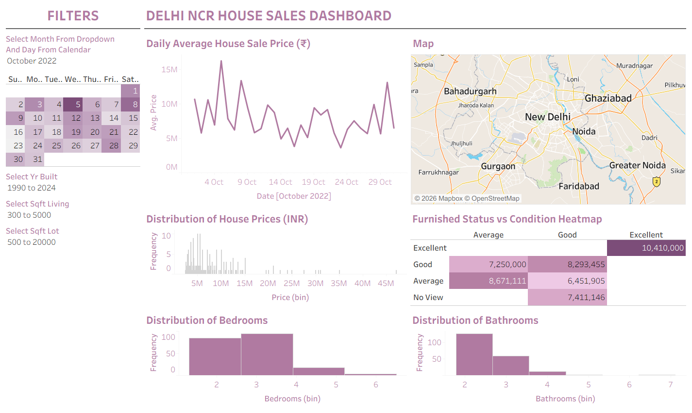

# Delhi-NCR-House-Sales
Visualizing Market Trends: An Analysis of House Sale Prices and Features in Delhi NCR using Tableau
# 🏠 Delhi NCR House Sales Dashboard
### Visualizing Market Trends: An Analysis of Sale Prices and Features using Tableau

---

## 📌 Project Overview
This project presents an interactive Tableau dashboard analyzing residential property sales across the **Delhi NCR region**, including Gurgaon, Noida, Ghaziabad, Faridabad, and New Delhi.

The dashboard explores how property features like size, condition, furnishing status, and location influence sale prices — providing insights into one of India's most active real estate markets.

---

## 🔗 Live Dashboard
👉 [View on Tableau Public](#) ← *Replace with your Tableau Public link*

---

## 📊 Dashboard Features

| Sheet | Description |
|-------|-------------|
| 🗺️ Map | Property locations across Delhi NCR colored by average price |
| 📈 Line Chart | Daily average sale price trend over time |
| 📊 Price Histogram | Distribution of house prices in INR |
| 🔥 Heatmap | Furnished Status vs Condition — average price comparison |
| 🛏️ BHK Distribution | Frequency of 1/2/3/4 BHK configurations |
| 🛁 Bathroom Distribution | Frequency chart of bathroom counts |

---

## 🎛️ Interactive Filters
- 📅 Month & Day calendar selector
- 🏗️ Year Built range slider
- 📐 Living Area (sqft) range slider
- 🏡 Plot Size (sqft) range slider

---

## 📁 Repository Files

| File | Description |
|------|-------------|
| `Delhi_NCR_House_Sales.twbx` | Tableau packaged workbook — open directly in Tableau Desktop |
| `Delhi_HouseData.csv` | Cleaned dataset with 7,738 property records across Delhi NCR |
| `dashboard_preview.png` | Screenshot of the final dashboard |

---

## 🗂️ Dataset Details

- **Source:** Delhi Housing Price Dataset (Kaggle)
- **Region:** Delhi NCR — Noida, Gurgaon, Ghaziabad, Faridabad, New Delhi
- **Records:** 7,738 properties
- **Time Period:** 2022 – 2024

### Key Columns

| Column | Description |
|--------|-------------|
| `price` | Sale price in INR |
| `price_INR_lakhs` | Sale price in Lakhs (₹) |
| `bedrooms` | Number of bedrooms (BHK) |
| `bathrooms` | Number of bathrooms |
| `sqft_living` | Living area in square feet |
| `sqft_lot` | Plot/lot size in square feet |
| `condition` | Property condition (Fair / Average / Good / Excellent) |
| `grade` | Quality grade (1–10) |
| `furnished_status` | Furnished / Semi-Furnished / Unfurnished |
| `building_type` | Flat or Individual House |
| `new_or_resale` | New Property or Resale |
| `city` | City within Delhi NCR |
| `locality` | Specific locality/sector |
| `lat` / `long` | Geographic coordinates |
| `yr_built` | Approximate year of construction |

---

## 🛠️ Tools & Technologies

- **Tableau Desktop 2023.2** — dashboard design & visualization
- **Python (pandas, numpy)** — data cleaning and transformation
- **Microsoft Excel** — data formatting
- **Dataset:** Kaggle — Delhi Housing Price Data

---

## 📸 Dashboard Preview

---

## 🚀 How to Use

1. Download `Delhi_NCR_House_Sales.twbx`
2. Open with **Tableau Desktop** (or **Tableau Public** desktop app)
3. The dataset is embedded — no reconnection needed
4. Use the filters on the left panel to explore the data

---
